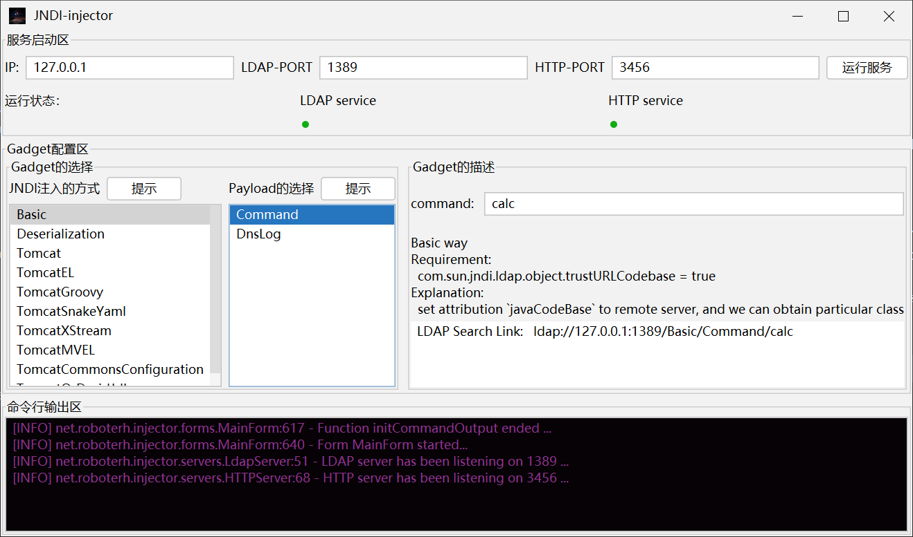

# JNDI-injector

这是一款GUI版的JNDI注入工具

参考了 [JNDIExploit](https://github.com/feihong-cs/JNDIExploit) 项目的部分代码

## 支持的JNDI注入方式

### 远程恶意类加载

1. [Basic](src/main/java/net/roboterh/injector/gadgets/Basic.java) : 直接通过设置`javaCodeBase`属性值进行远程恶意类的加载 (利用要求很高)

### 反序列化攻击

1. [Deserialization](src/main/java/net/roboterh/injector/gadgets/Deserialization.java) : 通过设置`javaSerializedData`属性值为一个反序列化漏洞利用链的序列化数据，在进行ldap查询时进行反序列化攻击本地的Gadgets (要求本地存在可利用的反序列化漏洞)

### 本地可利用的Reference Factory

#### org.apache.catalina.users.MemoryUserDatabaseFactory

1. [Tomcat](src/main/java/net/roboterh/injector/gadgets/Tomcat.java) :  通过利用在Tomcat中存在的`MemoryUserDatabaseFactory#getObjectInstance`方法进行XXE漏洞的触发

#### org.apache.naming.factory.BeanFactory

限制条件：Tomcat < 10.1.0-M14, 10.0.21, 9.0.63, 8.5.79 (高版本移除了forceString的特性)

1. [TomcatCommonsConfiguration](src/main/java/net/roboterh/injector/gadgets/TomcatCommonsConfiguration.java) : 通过利用在Tomcat中存在的`BeanFactory`或者`GenericNamingResourcesFactory`配合CommonsConfiguration依赖利用`SystemConfiguration#setSystemProperties`进行系统属性的覆盖，进而能够再次使用Basic的方式进行JNDI注入
2. [TomcatEL](src/main/java/net/roboterh/injector/gadgets/TomcatEL.java) : 通过利用在Tomcat中存在的`BeanFactory`类结合el-api依赖通过调用`ELProcessor#eval`执行任意javascript代码进行JNDI的注入
3. [TomcatGroovy](src/main/java/net/roboterh/injector/gadgets/TomcatGroovy.java) : 通过利用在Tomcat中存在的`BeanFactory`类结合Groovy依赖，利用`GroovyShell#evaluate / GroovyShell#parse / GroovyClassLoader#parseClass`等多种方法进行任意的Groovy脚本的执行
4. [TomcatMVEL](src/main/java/net/roboterh/injector/gadgets/TomcatMVEL.java) : 通过利用Tomcat中存在的`BeanFactory`类结合mvel依赖，利用`ShellSession#exec`方法执行任意的mvel表达式
5. [TomcatSnakeYaml](src/main/java/net/roboterh/injector/gadgets/TomcatSnakeYaml.java) : 通过利用在Tomcat中存在的`BeanFactory`类结合SnakeYaml依赖，利用`Yaml#load`进行任意的yaml脚本的执行(这里内置了动态修改Jar包的功能)
6. [TomcatXStream](src/main/java/net/roboterh/injector/gadgets/TomcatXStream.java) : 通过Tomcat中存在的`BeanFactory`类结合XStream依赖，利用`XStream#fromXML`方法进行任意的xml的加载，可以通过XStream的攻击方法进行注入

#### dbcp驱动 Factory
存在四类Factory
1. dbcp1_tomcat: `org.apache.tomcat.dbcp.dbcp.BasicDataSourceFactory`
2. dbcp2_tomcat: `org.apache.tomcat.dbcp.dbcp2.BasicDataSourceFactory`
3. commons-dbcp2: `org.apache.commons.dbcp2.BasicDataSourceFactory`
4. commons-dbcp1: `org.apache.commons.dbcp.BasicDataSourceFactory`

1. [TomcatOrDruidJdbc](src/main/java/net/roboterh/injector/gadgets/TomcatOrDruidJdbc.java) : 通过利用在dbcp-tomcat / commons-dbcp / tomcat-jdbc / druid等中存在的`BasicDataSourceFactory / DruidDataSourceFactory`等Factory类结合JDBC-driver进行特定的JDBC-attack

#### org.apache.naming.factory.ResourceFactory

1. [TomcatTwiceInject]

## 支持的利用Payload

### 常见的Payload

- [DnsLog](src/main/java/net/roboterh/injector/enums/PayloadEnum.java) : 支持dns查询
- [Command](src/main/java/net/roboterh/injector/enums/PayloadEnum.java) : 支持命令执行
- [ReverseShell](src/main/java/net/roboterh/injector/enums/PayloadEnum.java) : 执行简易的反弹shell的方法

### 特殊文件的指定

- [File](src/main/java/net/roboterh/injector/enums/PayloadEnum.java) : 支持在可以执行任意的脚本的使用使用在`/data`文件夹下的文件，进行特定的脚本文件执行(javascript代码 / Groovy脚本 / MVEL表达式 / yaml脚本 / 加载的xml文件)
- [JavaFile](src/main/java/net/roboterh/injector/enums/PayloadEnum.java) : 支持加载指定的.java内存马文件

### 内存马Payload

**注意**

在内存马中，涉及路由都是`/shell`，涉及传参都是`cmd`Header头

- [TomcatEcho](src/main/java/net/roboterh/injector/templates/TomcatEcho.java) : 支持Tomcat的回显马注入
- [TomcatServlet](src/main/java/net/roboterh/injector/templates/TomcatServlet.java) : 支持Tomcat中间件在Servlet层的内存马注入
- [TomcatListener](src/main/java/net/roboterh/injector/templates/TomcatListener.java) : 支持在Tomcat中间件在Listener层的内存马注入
- [TomcatFilter](src/main/java/net/roboterh/injector/templates/TomcatFilter.java) : 支持Tomcat中间件在Filter层的内存马注入
- [TomcatExecutor](src/main/java/net/roboterh/injector/templates/TomcatExecutor.java) : 支持Tomcat中间件在Executor层的内存马注入
- [TomcatUpgrade](src/main/java/net/roboterh/injector/templates/TomcatUpgrade.java) : 支持Tomcat中间件在Upgrade层的内存马注入
- [TomcatValve](src/main/java/net/roboterh/injector/templates/TomcatValve.java) : 支持Tomcat中间件在Valve层的内存马注入
- [TomcatWebsocket](src/main/java/net/roboterh/injector/templates/TomcatWebsocket.java) : 支持Tomcat中间件在Websocket层的内存马注入
- [SpringEcho](src/main/java/net/roboterh/injector/templates/SpringEcho.java) : 支持Spring中间件的回显🐎的注入
- [SpringController](src/main/java/net/roboterh/injector/templates/SpringController.java) : 支持Spring中间件在Controller层的回显🐎的注入
- [SpringInterceptor](src/main/java/net/roboterh/injector/templates/SpringInterceptor.java) : 支持Spring中间件在Interceptor层的回显🐎的注入

## Usage

### GUI mode

首先在jar包的同级目录创建`data`文件夹，并复制本项目的data文件夹下内容



之后直接在图形化界面中进行目标环境的选择

- 头部分别是ldap服务的ip地址，端口和对应的http服务的端口号
- 中部从左到右分别是：JNDI注入方式的选择，对应Payload的选择， 特定参数的输入和对应的ldap查询链接的生成
- 尾部是一些日志的输出(选用log4j)

### Cli mode

添加`cli`标识启动Cli mode

```bash
java -jar .\JNDI-injector.jar cli -h

# start default
java -jar .\JNDI-injector.jar cli
```

之后使用GUI动态生成的Ldap Search Link进行相同的查询方式即可

## Contributions
LeeH-money
bro-xxxx
## TODO

1. 添加更多样化的内存马注入和注入方式
2. 进行命令执行的优化(支持绕过RASP等防护)
